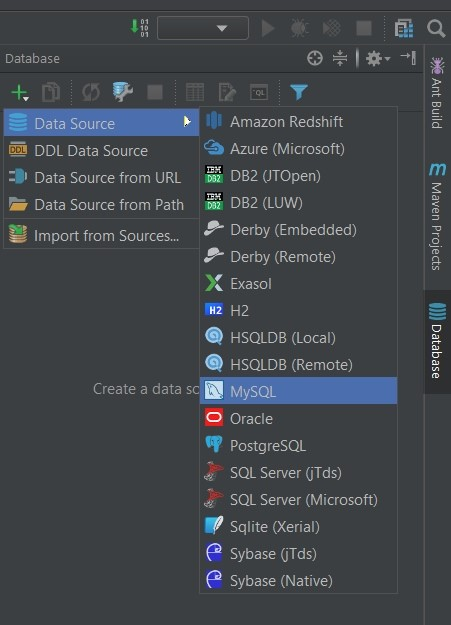

# Практическая задача 1
# Работа с базой при помощи JDBC

*Если ты видишь не отформатированный текст ниже, то убедись, что у тебя установлен плагин Markdown.
Если он установлен, то можешь нажать на иконку preview справа сверху, рядом с тремя точками, для более удобного просмотра документа*

Для выполнения задания необходимо:
* Установить на компьютер MySqlServer и Workbench. Создать подключение и схему через Workbench. 
* Протестировать возможность соединения с базой через IntelliJ Idea с помощью встроенной утилиты, как показано на рисунке:

****

Для задачи вместо MySql можно использовать PostgresSql, но тогда не забудь в pom.xml заменить драйвер для базы данных
на драйвер Postgres.

# Описание задачи:
Необходимо ознакомиться с заготовкой и доработать приложение, которое взаимодействует с базой оперируя пользователем (класс User) и проверить свои методы заранее написанными JUnit тестами. По итогу все тесты должны быть пройдены. Разрешается посмотреть реализацию тестов.

Для запуска теста необходимо найти класс в папке test (показано в предыдущей лекции) и при нажатии на него правой кнопкой мыши запустить, выбрав Run «Имя класса»

Класс UserHibernateDaoImpl в рамках этой задачи не затрагивается (остаётся пустой)

User представляет собой сущность с полями:

Long id  
String name  
String lastName  
Byte age

Архитектура приложения создана с опорой на паттерн проектирования MVC (частично, у нас не WEB приложение)  
Рекомендую ознакомиться с этим паттерном, так как его понимание поможет понять логику работы современных WEB приложений.

# Требования к классам приложения:
1. Классы dao/service должны реализовывать соответствующие интерфейсы
2. Класс dao должен иметь конструктор пустой/по умолчанию
3. Все поля должны быть private
4. service переиспользует методы dao
5. Обработка всех исключений, связанных с работой с базой данных должна находиться в dao
6. Класс Util должен содержать логику настройки соединения с базой данных
7. Класс UserDaoJDBCImpl должен быть реализован без использования Hibernate

# Необходимые операции:
1. Создание таблицы для User(ов) — не должно приводить к исключению, если такая таблица уже существует
2. Удаление таблицы User(ов) — не должно приводить к исключению, если таблицы не существует
3. Очистка содержания таблицы
4. Добавление User в таблицу
5. Удаление User из таблицы (по id)
6. Получение всех User(ов) из таблицы

# Алгоритм работы приложения:
*В методе main класса Main должны происходить следующие операции:*

1. Создание таблицы User(ов)
2. Добавление 4 User(ов) в таблицу с данными на свой выбор. После каждого добавления должен быть вывод в консоль (User с именем — name добавлен в базу данных)
3. Получение всех User из базы и вывод в консоль (должен быть переопределен toString в классе User)
4. Очистка таблицы User(ов)
5. Удаление таблицы

После выполнения задания commit и push в удаленный репозиторий, и ментор проведет ревью